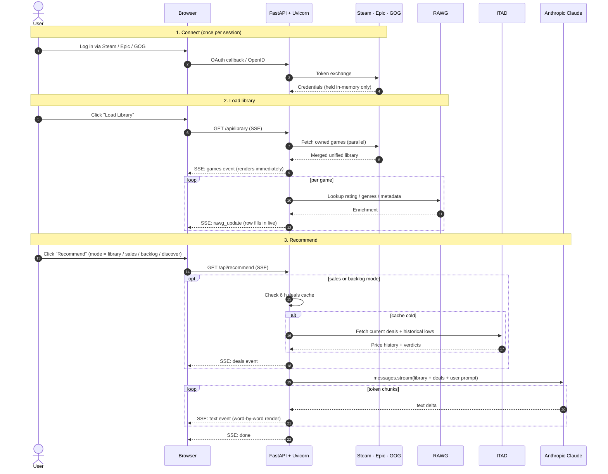

# CRIT — Case Study

**A self-hosted, AI-powered game recommender that reasons about my actual play history across Steam, Epic, and GOG to provide informed game reccomendations.**

## The problem

After a decade of Steam sales, Humble bundles, and Epic giveaways, I own hundreds of games across three stores and no good way to decide what to play next. Existing recommenders look at one storefront at a time, don't know what I've already finished, So I put together something that looks at my total library across three platforms, my steam playtime, and current deals, and reccomends me what I should play next from my current library or deep discount sales.

<!-- HERO SCREENSHOT — main app view with library loaded and a recommendation mid-stream.
     Suggested filename: docs/screenshots/hero.png
     Suggested size: 1400px wide -->

## What it does

CRIT unifies a user's full library from three platforms, hands that taste profile to Claude, and streams back a reasoned pick-of-the-day — from games already owned, current sales, the unplayed backlog, or something new entirely.

> **Repo:** https://github.com/Airwhale/CRIT · **Stack:** FastAPI · SSE streaming · Claude (Sonnet 4.6 / Haiku 4.5 / Opus 4.6) · vanilla JS frontend

---

## Why this was interesting to engineer

Most "game recommender" projects stop at calling a content-based similarity API. The interesting problems in CRIT live elsewhere:

- **Three unrelated auth systems, each with real constraints.** Steam OpenID 2.0, Epic Games OAuth (public launcher client ID only accepts `localhost` redirects), GOG OAuth (fixed `embed.gog.com` redirect URI, so the server can't receive the callback directly). Each flow has a primary path and a manual-paste fallback for when the primary path breaks — designed to degrade gracefully rather than leave the user stuck.
- **Streaming is the product.** Recommendations stream word-by-word from Claude via Server-Sent Events rather than waiting for a full response. The UX effect — "Claude is thinking out loud" — is the single biggest reason this feels different from a typical tool.
- **Cost-aware LLM integration.** The library taste profile is passed with `cache_control: ephemeral` so the ~5 KB context isn't re-billed on every call. Models and "deep thinking" are user-selectable so cost and quality scale to the question.
- **External data correlation.** IsThereAnyDeal historical price data is batched, cached, and verdicted (all-time low / near low / below regular) to give each deal a second dimension beyond "% off."

## How a recommendation flows end-to-end

Left to right: connect platforms once, load library (fetch + enrich), then ask Claude to reason over the assembled profile. Claude only runs after every input it needs is in hand.

<!-- ARCHITECTURE / UNIFIED LIBRARY SCREENSHOT — the merged library table with all three
     platforms visible, RAWG ratings filled in, sortable columns.
     Suggested filename: docs/screenshots/library.png -->

## Engineering decisions I'd defend

- **Credentials in memory, history on disk.** Secrets (API keys, OAuth tokens) live only in `_sessions` and die on restart — explicitly so that a home-server deploy can't leak them. Recommendation history persists because it's user-owned and useful across sessions. The asymmetry is deliberate, not accidental.
- **Fetch broadly, filter locally.** The deals cache stores the full source feed (no discount threshold, no owned filter). `/api/deals`, sales-mode recommendations, and backlog-mode recommendations all apply their own filters against one shared fetch. Three consumers, one network round-trip, 6-hour TTL.
- **SSE over WebSockets.** The streaming is one-way (server → client) and single-session. SSE gives the same "alive" feel with less infrastructure, clean reverse-proxy behavior (`proxy_buffering off` is the only Nginx knob), and trivial reconnect semantics.
- **Vanilla JS, no build step.** One 3 KLoC HTML template, no bundler, no framework overhead. The trade-off is real — a component system would make the frontend easier to grow — but for a single-purpose tool it keeps the footprint small and the dev loop instant.
- **Prompt-level safety nets.** Every recommendation mode passes the full owned-titles list in the prompt and explicitly instructs Claude not to suggest games already in the library, even when they appear in the deals feed on a different store. Cross-platform dedup by name where app-IDs don't match.

<!-- STREAMING RECOMMENDATION SCREENSHOT — Claude output mid-stream, with a visible cursor
     and a partial recommendation. Ideally captured during the "Discover" or "From Library" mode.
     Suggested filename: docs/screenshots/streaming.png -->

<!-- DEALS TABLE SCREENSHOT — scrollable deals table with historical-low badges from ITAD
     and a "Buy →" column. Great to capture during a sale period.
     Suggested filename: docs/screenshots/deals.png -->

## Numbers

- **~5,000** lines of Python across the backend, platform adapters, and prompt builders
- **196** pytest tests, all externals mocked (no network calls in CI)
- **3** OAuth / identity flows (Steam, Epic, GOG), each with a fallback path
- **4** recommendation modes (From Library, Steam Deals, Backlog, Discover)
- **6-hour** session-scoped deals cache, shared across three endpoints
- **3 models** selectable at request time (Haiku 4.5 / Sonnet 4.6 / Opus 4.6)

## Trade-offs worth naming

- **Single-user session model.** Good: simple, secure by design. Bad: not multi-tenant — would need a real session store (Redis or similar) and proper isolation to expose publicly.
- **Client-side deal-source filtering.** Good: one broad fetch serves everything. Bad: source tagging uses a store-name heuristic; if a platform renames its store string, the filter fails open.
- **File-backed history.** Good: zero infra, survives restart. Bad: doesn't scale beyond one user and isn't encrypted at rest — fine for a home-server tool, not fine for a shared deployment.

---

*Built as a personal tool and deliberately scoped that way — a real, working system that exercises OAuth, streaming LLMs, external data integration, and thoughtful caching, without pretending to be something it's not.*
