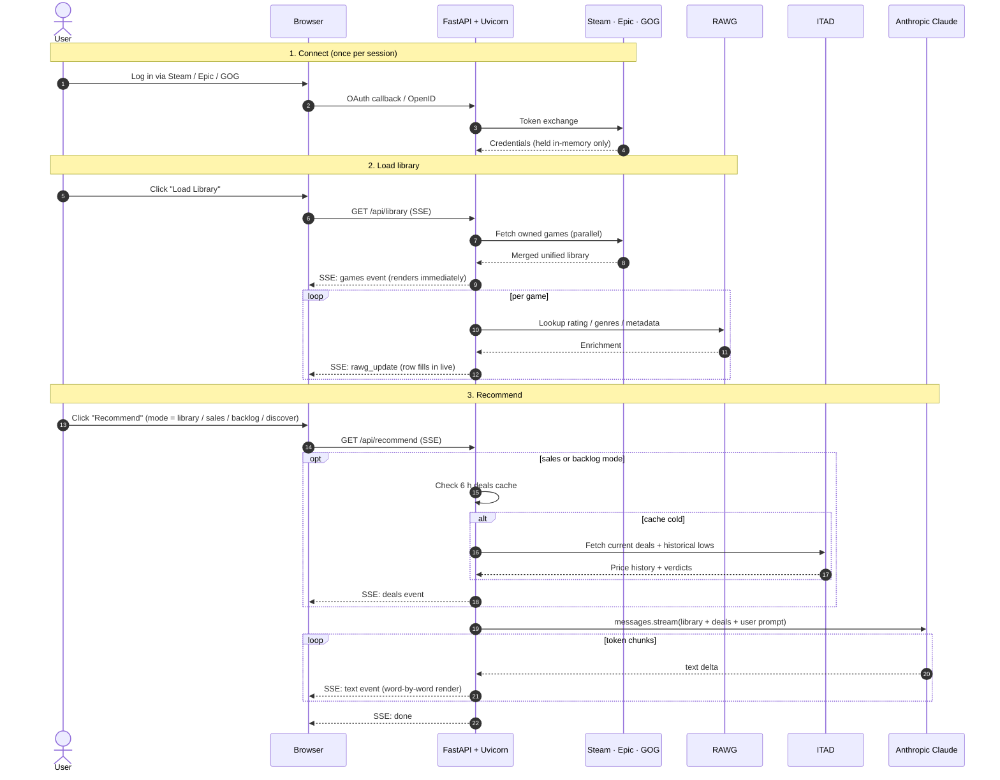

# CRIT — Engineering Brief

**A self-hosted, AI-powered game recommender that reasons about my actual play history across Steam, Epic, and GOG to provide informed game reccomendations.**

## The problem

After a decade of Steam sales, Humble bundles, and Epic giveaways, I own hundreds of games across three stores and no good way to decide what to play next. Existing recommenders look at one storefront at a time, don't know what I've already finished, So I put together something that looks at my total library across three platforms, my steam playtime, and current deals, and reccomends me what I should play next from my current library or deep discount sales.

## What it does

Pulls your library from Steam, Epic, and GOG into one view. Hands it to Claude along with playtime, genre, and whatever mood you typed in. Streams back a pick — from what you own, what's on sale, what you haven't played, or something new.

> **Repo:** https://github.com/Airwhale/CRIT · **Stack:** FastAPI · SSE · Anthropic SDK · vanilla JS

---

## Interesting engineering problems

- **Three auth systems, three sets of constraints.** Steam speaks OpenID 2.0. Epic's public launcher client ID only accepts `localhost` redirects. GOG pins its redirect to `embed.gog.com`, so the server can't receive the callback directly. Each one has a fallback where the user pastes a code from the URL bar.

- **Slow dependency, progressive render.** RAWG metadata for 300 games takes 30 seconds. The library table renders as soon as the platform fetch returns; ratings fill in per row as each RAWG call completes. You're reading the table while we're still fetching.

- **Cross-store ownership without a fuzzy-match library.** "Hades" on Steam, "Hades™" on Epic, "Hades: Game of the Year Edition" on GOG — same game, three titles. A normalizer (lowercase, strip trademark marks, drop edition suffixes) does exact match on the result. The prompt also carries the owned-titles list as a backstop, so anything the normalizer misses, Claude skips. Two layers, no fuzzy-string dependency.

- **Historical price correlation.** IsThereAnyDeal prices are batched, cached, and verdicted — all-time low, near low, below regular. A 30% discount on a game that hits 70% off every summer reads differently from a first-ever discount.

## How it flows

Connect once, load library (fetch + enrich), then ask Claude. Claude runs last, after every input is assembled.

## Numbers

- ~5,000 lines of Python
- 196 pytest tests, all externals mocked
- 3 OAuth / identity flows with fallbacks
- 4 recommendation modes
- 6-hour deals cache, 3 endpoints sharing it
- 3 models selectable per request (Haiku 4.5 / Sonnet 4.6 / Opus 4.6)

## Trade-offs

- **Single-user sessions.** Simple and secure; not multi-tenant. Exposing publicly would need a real session store.
- **Deal-source tagging by store name.** If Humble renames itself, the filter fails open. Cheap and works today.
- **History in a flat JSON file.** No infra, survives restart. Not encrypted, not scalable — wrong for a shared deploy, right for this one.

---

*Built for one user on purpose. Product-side reasoning in [PRODUCT_BRIEF.md](PRODUCT_BRIEF.md).*
