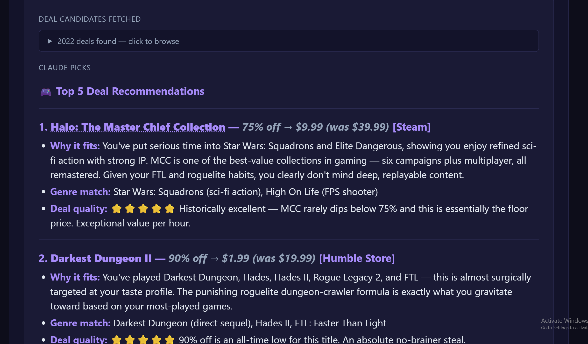
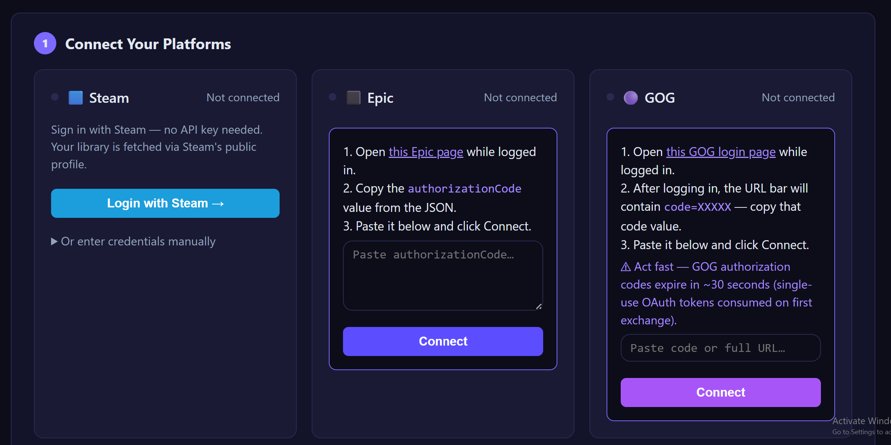
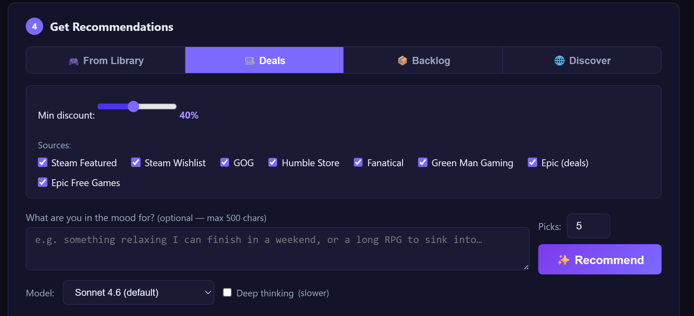
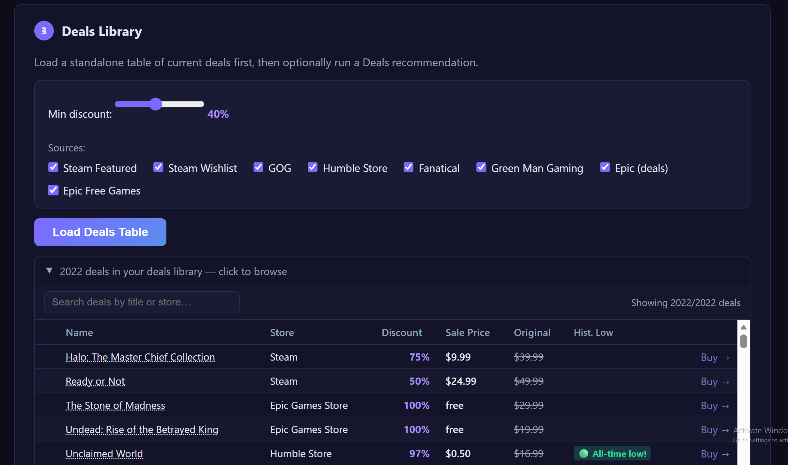

# CRIT — Product Brief

**A self-hosted, AI-powered game recommender that reasons about my actual play history across Steam, Epic, and GOG to provide informed game recommendations.**

## The problem

After a decade of Steam sales, Humble bundles, and Epic giveaways, I own hundreds of games across three stores and no good way to decide what to play next. Existing recommenders look at one storefront at a time, don't know what I've already finished, So I put together something that looks at my total library across three platforms, my steam playtime, and current deals, and reccomends me what I should play next from my current library or deep discount sales.

## Who this is for

PC gamers with libraries on two or three stores, who grab the free Epic game every week and own a few hundred titles by now. Comfortable self-hosting and bringing their own API keys.

## What it needs to do

I have ninety minutes tonight to play a game. Give me a reccomendationon something I will like. That's it.

The decision happens most evenings, the stakes are low, and it's defined by trust. If I don't believe the pick, I'll burn twenty minutes second-guessing it instead of playing.

## Existing options fall short

- **Steam's own recommendations** only see Steam and push what Valve wants to sell.
- **Similarity tools** match games to games. They don't know what I have spent time playing in the past.
- **HowLongToBeat, Metacritic** — useful, but they don't pick.
- **"What should I play" subreddits** — personal but slow and blind to my library.

Nothing combines my whole library, what I've actually played, reviews, and current prices. An LLM with those inputs can.

## Bets

- Players think about *their games*, not *their Steam*. One unified table across stores.
- Four named modes — play / buy / backlog / discover — instead of one "recommend" button. Each have different prompts and a different user flow.
- Free-text mood beats dropdowns. Users write more useful context than they'd click.
- No stored credentials. You re-log-in after a restart; nothing leaks.

## If I shipped this publicly, I'd cut

- Model choice and the thinking toggle. Advanced menu only.

## And I'd add

- Onboarding. There's nothing today.
- Thumbs up/down on picks, fed into the next prompt.
- A mobile layout. The deals table is hostile on a phone.
- Share a pick as an image. Cheap viral loop.

## Metrics I'd watch

- **Acceptance rate** — how often do users click through on the pick.
- **Time to decide** — Recommend click → outbound click. Should drop as the model learns you.
- **Return rate** — weekly active is the real signal.

---

CRIT is what I use three nights a week. Engineering side in [CASE_STUDY.md](CASE_STUDY.md).
